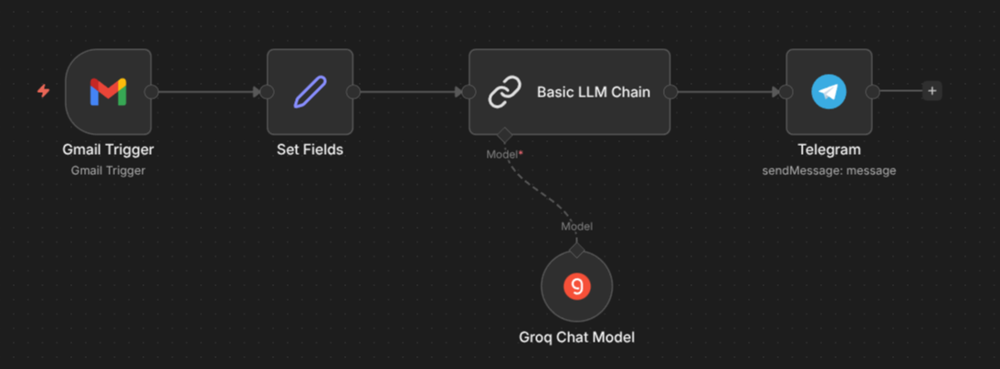

# 📧➡️ Email Summary to Telegram

> Automatically summarizes incoming Gmails  using an LLM chain and sends the digest to your Telegram chat — no manual inbox checking needed everytime .

---

## 🗺️ Workflow Overview



---

## 🔍 What This Workflow Does

Every minute, this automation:
1. **Watches your Gmail inbox** for new emails
2. **Extracts** the sender, subject, and email snippet
3. **Summarizes** the email using an LLM (Groq — Llama 3.1 8B Instant)
4. **Sends** a clean, structured summary to your Telegram chat

---

## 🧩 Workflow Nodes

| Step | Node | Description |
|------|------|-------------|
| 1 | `Gmail Trigger` | Polls Gmail every minute for new messages |
| 2 | `Set Fields` | Extracts `From`, `Subject`, and `Snippet` from the email |
| 3 | `Basic LLM Chain` | Prompts the LLM to summarize the email into a clean format |
| 4 | `Groq Chat Model` | Runs `llama-3.1-8b-instant` via Groq API as the LLM backend |
| 5 | `Telegram` | Sends the final summary to a specified Telegram chat |

---

## 📤 Output Format

The Telegram message follows this structured template:

```
From: <sender name and email>
Subject: <subject line>
Summary: <brief description of the email content>
Recommended Action: <what to do with this email>
```

---

## ⚙️ Setup Instructions

### 1. Prerequisites
- [n8n](https://n8n.io/) instance (self-hosted or cloud)
- A Gmail account with OAuth2 connected in n8n
- A [Groq API key](https://console.groq.com/) (free tier available)
- A Telegram bot token and your chat ID

### 2. Import the Workflow
1. Copy the `email-summary-to-telegram.json` file
2. In n8n, go to **Workflows → Import from File**
3. Select the JSON file and import

### 3. Configure Credentials
| Credential | Where to Set |
|------------|--------------|
| Gmail OAuth2 | `Gmail Trigger` node → Credentials |
| Groq API Key | `Groq Chat Model` node → Credentials |
| Telegram Bot Token | `Telegram` node → Credentials |

### 4. Update Your Telegram Chat ID
- Open the `Telegram` node
- Replace `chatId` with your own Telegram chat ID
- You can get it by messaging [@userinfobot](https://t.me/userinfobot) on Telegram

### 5. Activate the Workflow
- Toggle the workflow to **Active**
- It will now poll Gmail every minute automatically

---

## 🛠️ Customization Tips

- **Change poll frequency**: Edit the `Gmail Trigger` node → poll time (e.g., every 5 minutes)
- **Filter emails**: Add filters in the `Gmail Trigger` node (e.g., only unread, specific labels)
- **Swap the LLM**: Replace `Groq Chat Model` with OpenAI, Mistral, or any other supported model
- **Change summary format**: Edit the prompt inside `Basic LLM Chain` to match your preferred output style

---

## 📁 Files

```
n8n-workflows/
└── email-summary-to-telegram/
    ├── README.md                        ← You are here
    └── email-summary-to-telegram.json  ← Import this into n8n
```

---

## 🧠 Model Used

| Model | Provider | Notes |
|-------|----------|-------|
| `llama-3.1-8b-instant` | [Groq](https://groq.com/) | Fast, free-tier friendly |

---

## 📌 Notes

- The Gmail Trigger uses a **snippet** (not the full email body). For full body parsing, switch to the Gmail node with `Get Message` action.
- Make sure your Telegram bot has been started (send `/start` to it) before activating.

---

*Part of my n8n workflow automation learning series. More workflows coming soon!*
